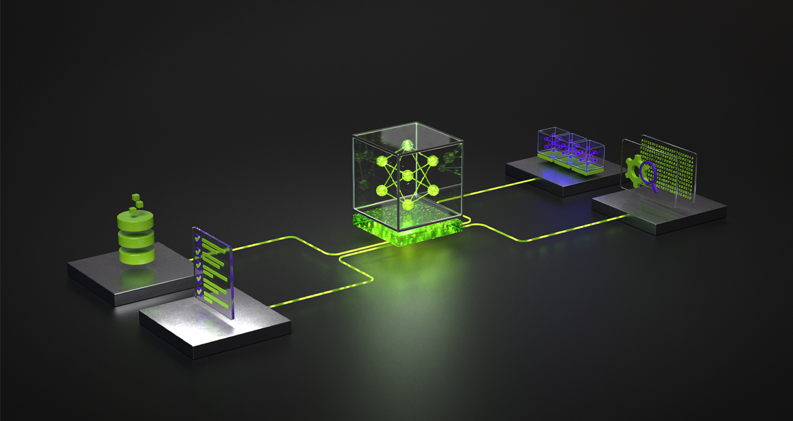

# Nemotron Reasoning Lab

Research-driven experiments to improve reasoning accuracy for the NVIDIA Nemotron reasoning challenge.

[](#)
[](#)
[](#)
[](#)

<!-- Hero banner -->


## Why This Repo Exists

This project is built as a complete, reproducible reasoning system:

- Prompting and reasoning strategies (CoT, ToT, reflection, self-consistency)
- Data cleaning and synthetic reasoning generation
- LoRA fine-tuning workflow for competition-style adaptation
- Evaluation loop with leaderboard tracking
- Submission packaging helpers (adapter validation and zip)

## Quick Start

```bash
git clone https://github.com/Hardik-Sankhla/nvidia-nemotron-reasoning.git
cd nvidia-nemotron-reasoning
pip install -r requirements.txt
```

### Run One Command Per Mode

```bash
python scripts/run_pipeline.py --mode train --config configs/train.yaml
python scripts/run_pipeline.py --mode eval --config configs/eval.yaml
python scripts/run_pipeline.py --mode full --config configs/full_run.yaml
```

### Launch Dashboard

```bash
streamlit run app.py
```

## Interactive Project Map

<details>
<summary><strong>Pipeline Flow</strong></summary>

```text
Data -> Cleaning -> Synthetic Data -> Prompt Optimization
	-> Reasoning (CoT/ToT/Self-Consistency/Reflection)
	-> Model (HF + LoRA)
	-> Evaluation -> Leaderboard -> Submission Packaging
```

</details>

## Workflow (visual)


<details>
<summary><strong>Key Folders</strong></summary>

```text
configs/      # YAML configs for train/eval/full runs
data/         # raw/processed/external + starter train.csv
docs/         # benchmark notes, strategy, architecture docs
experiments/  # experiment notes and results snapshots
notebooks/    # EDA, experiments, Kaggle write-up
reports/      # leaderboard and findings
scripts/      # train/eval/full orchestration
src/          # data/reasoning/models/evaluation modules
```

</details>

<details>
<summary><strong>Core Modules</strong></summary>

- `src/data/cleaning.py`: dataset quality filters
- `src/data/synthetic.py`: synthetic reasoning sample generation
- `src/reasoning/self_consistency.py`: majority-vote answer selection
- `src/reasoning/prompt_optimizer.py`: template-based prompt search
- `src/models/local_models.py`: local HF model wrapper
- `src/models/nemotron_lora.py`: adapter validation and submission zip
- `src/evaluation/leaderboard.py`: experiment tracking into CSV

</details>

## Current Experiment Snapshot

| Experiment | Technique | Accuracy | Notes |
|---|---|---|---|
| exp_001 | Baseline | 0.52 | Direct prompting |
| exp_002 | CoT | 0.61 | Step-by-step reasoning |
| exp_003 | Self-Consistency | 0.68 | Majority voting |
| exp_004 | Synthetic + LoRA | In progress | Training run pending |

## What Makes This Useful

- Reproducible YAML-driven workflow instead of one-off scripts
- Unified runner (`run_pipeline.py`) for train/eval/full modes
- Dashboard for fast analysis and comparison by technique/model/rank
- Notebook-ready write-up structure for Kaggle submissions

## Practical Notes

- `configs/train.yaml` expects `data/train.csv` (starter file is included).
- Large model runs may require GPU and model access permissions.
- LoRA artifacts should include `adapter_config.json` for submission compatibility.

## Roadmap

- Stronger synthetic data quality scoring
- Better answer extraction and numeric normalization
- Configurable ablation runner and batch experiment launcher
- RL-based refinement loop (future)

## Contributing

Contributions, issue reports, and experiment ideas are welcome.

## Author

Hardik Sankhla  
Building in public.

